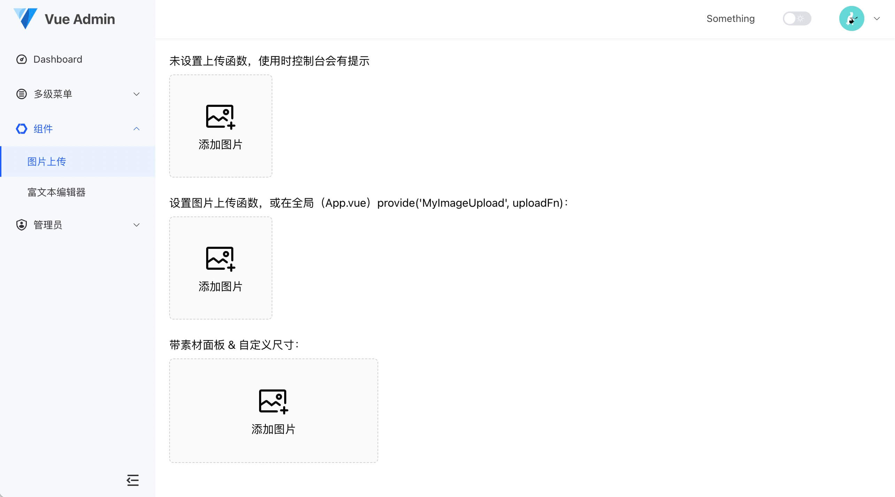
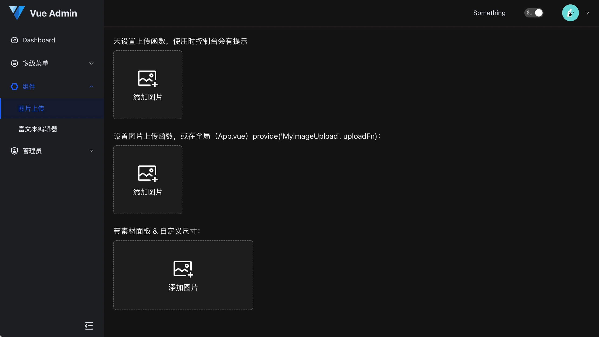

# vue-admin-template-plus

- 2023-07-12 更新：
- 重构，更新 `Element Plus` 等到最新版本
- 支持暗黑模式，主题通过 CSS 变量可配
- 增加图片上传、富文本组件




> 这是一个极简的 vue admin 管理后台。它只包含了 Vue 3.0 & Element Plus & axios & UnoCSS & permission control & lint，这些搭建后台必要的东西。

[线上地址（待更新）](https://thiszhong.github.io/vue-admin-template-plus)

[国内访问（待更新）](https://thiszhong.gitee.io/vue-admin-template-plus)

## 相关文档

[Element Plus](https://element-plus.gitee.io/#/zh-CN/component/installation)

[Vue 3.0](https://v3.cn.vuejs.org/)

## Build Setup

```bash
# 克隆项目
git clone https://github.com/thiszhong/vue-admin-template-plus.git
# 进入项目目录
cd vue-admin-template-plus
# 安装依赖
npm install
# 建议不要直接使用 cnpm 安装以来，会有各种诡异的 bug。可以通过如下操作解决 npm 下载速度慢的问题
npm install --registry=https://registry.npm.taobao.org
# 启动服务
npm run dev
```

浏览器访问 [http://localhost:5173](http://localhost:5173)

## 打包

```bash
# 构建生产环境
npm run build
```

## Browsers support

同 Vue 3.0

## License

[MIT](https://github.com/thiszhong/vue-admin-template-plus/blob/master/LICENSE) license.
